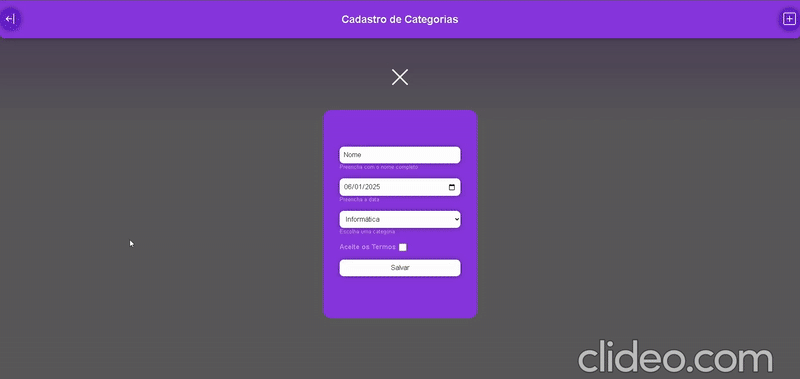
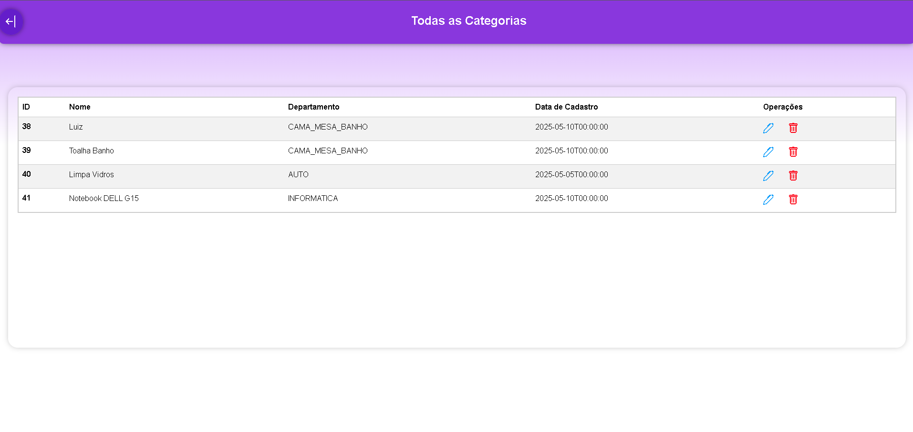
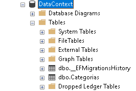

 
 

O projeto foi desenvolvido em ambientes distintos: o front-end foi criado no Visual Studio Code, utilizando HTML, CSS e JavaScript puro para manipulação do DOM e consumo da API; já o back-end foi construído com ASP.NET Web API, juntamente com o Entity Framework para a conexão com o banco de dados SQL Server.

Em resumo, o sistema permite o trânsito de dados da interface web, passando pelo ASP.NET até o SQL Server — e o processo inverso também ocorre de forma contínua e integrada.

Além disso, foi utilizado o Swagger UI, uma ferramenta que permite visualizar, interagir e testar APIs REST diretamente no navegador. Com ela, foi possível enviar requisições (GET, POST, PUT, DELETE, entre outras) e visualizar as respostas de forma prática e interativa.

<h1>Swagger UI</h1>

  

<h1>Requisição Get, gerando a lista com todos os cadastros</h1>

  

<h1>Banco SQLServer implantado localmente</h1>

  

